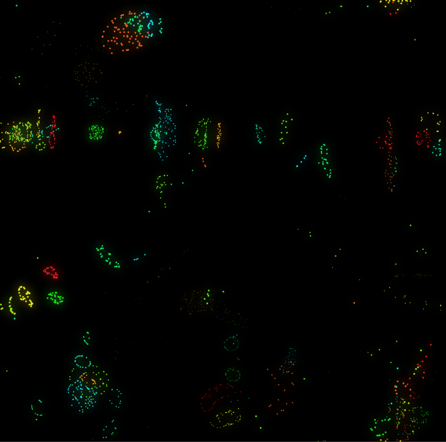
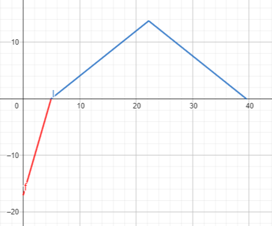

# Particle Life



A simple simulation of a few particles which interact in certain ways with each other \
[reference video](https://youtu.be/p4YirERTVF0?si=sX0a0zlbzM3_8Q86)


## Function 
This is how the force function looks like, it consists of two parts.
1. The Global (red) function which repels every particle when it comes to close
2. The Color-Color specific (blue) function which pulls or pushes particles of certain color based on a random table

```js
// distance = distance between any two particles
// force = value between -1 and 1, descries how two colors interact with each other
// strength = Multiples the result to in/decrease the effectiveness
// hardness = How steep the red part of the function should be
const f = (distance, force) => {
    // to far away
    if (distance > range)
        return 0; 
    
    // to close: global repel
    if (distance < range * 0.125)
        return ((8 * distance) / range - 1) * (strength * hardness); 
    
    // color specific function
    return ((-16 * force * Math.abs(distance - (9 / 16) * range)) / (7 * range) + force) * strength;  
};
```




## Comment
This projects was really fun, not that hard but still challenging in a way I always was motivated to continue and never thought about giving up! And im really proud of the result! And I finally understand how the neighborhood search optimization thing works :D