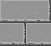

# Shared Resources

### Mission
Every participant creates or chooses one sound and two images. \
After collecting them, we all need to make something out of these assets. \
You have to use all except 3 of the assets.

### Used Assets

| Asset | Submitted by ... |
|:-:|:-:|
|   | [Kryall](https://github.com/Da-Real-Kryall) |
|  | [IanToujou](https://github.com/IanToujou) |
|  | [IanToujou](https://github.com/IanToujou) |
| `*.mp3` | [IanToujou](https://github.com/IanToujou) |
|  | [Chicken](https://github.com/Chicken) >>> [link](https://opengameart.org/content/2d-vegetables) |
|  | [WilsontheWolf](https://github.com/WilsontheWolf) |
|  | [WilsontheWolf](https://github.com/WilsontheWolf) |
|  | [Amber](https://github.com/uselessamber) |
|  | [Amber](https://github.com/uselessamber) |
| `sfx.wav` | [Amber](https://github.com/uselessamber)
| `ScoreUpdateSound (1).wav` | me >>> [link](https://sfxr.me/)
|  | me |
|  | me |

### Comment

Didn't use all ~47 assets, which mad it easier for me \
Also, please don't hurt me, I know this code is a unforgiving crime. \
And I did this in about 2-3 hours of active working, \
so don't expect to much :)
